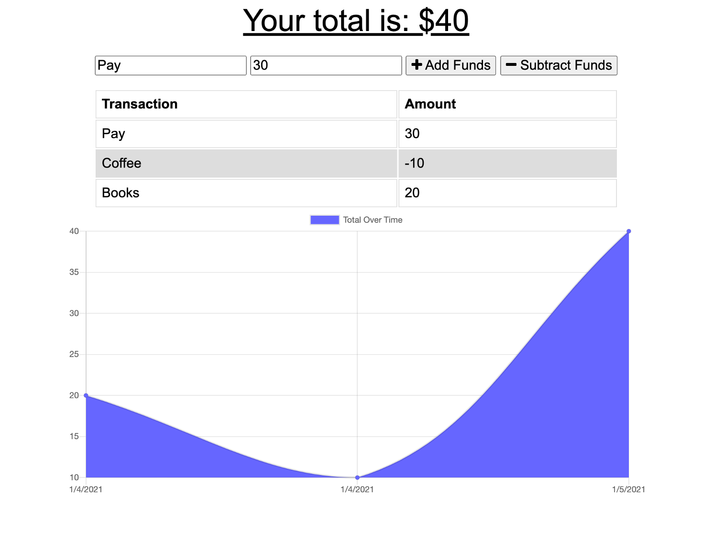

# BudgetTracker
A tool for travellers to keep up to date with their finances, on and offline.

## Description
BudgetTracker is an online app for recording income and expenditure.  Users can add items they spend and their cost, as well as income items and their value.  The app also includes a balance view, displaying income and expenditure over time.  Users are able to add items on or offline, for example if they are travelling.

## Motivation
Travel may not be everyone's first thought during COVID-19, but staying on top of finances certainly is.  BudgetTracker helps everyone keep track of their income and expenditure, large and small.  And with offline functionality, items can be added immediately, before they are forgotten.

## Screenshots



## Build status
Minimum Viable Product. Ready for use, but requiring further testing and feedback.

## Key technologies
Javascript
MongoDB
Node Experess

## Installation
Requires NPM, otherwise working on Heroku

## Code Example
```let transactions = [];
let myChart;

fetch("/api/transaction")
  .then(response => {
    return response.json();
  })
  .then(data => {
    // save db data on global variable
    transactions = data;

    populateTotal();
    populateTable();
    populateChart();
  });

function populateTotal() {
  // reduce transaction amounts to a single total value
  let total = transactions.reduce((total, t) => {
    return total + parseInt(t.value);
  }, 0);

  let totalEl = document.querySelector("#total");
  totalEl.textContent = total;
}

function populateTable() {
  let tbody = document.querySelector("#tbody");
  tbody.innerHTML = "";

  transactions.forEach(transaction => {
    // create and populate a table row
    let tr = document.createElement("tr");
    tr.innerHTML = `
      <td>${transaction.name}</td>
      <td>${transaction.value}</td>
    `;

    tbody.appendChild(tr);
  });
}

function populateChart() {
  // copy array and reverse it
  let reversed = transactions.slice().reverse();
  let sum = 0;

  // create date labels for chart
  let labels = reversed.map(t => {
    let date = new Date(t.date);
    return `${date.getMonth() + 1}/${date.getDate()}/${date.getFullYear()}`;
  });

  // create incremental values for chart
  let data = reversed.map(t => {
    sum += parseInt(t.value);
    return sum;
  });

  // remove old chart if it exists
  if (myChart) {
    myChart.destroy();
  }

  let ctx = document.getElementById("myChart").getContext("2d");

  myChart = new Chart(ctx, {
    type: 'line',
      data: {
        labels,
        datasets: [{
            label: "Total Over Time",
            fill: true,
            backgroundColor: "#6666ff",
            data
        }]
    }
  });
}

function sendTransaction(isAdding) {
  let nameEl = document.querySelector("#t-name");
  let amountEl = document.querySelector("#t-amount");
  let errorEl = document.querySelector(".form .error");

  // validate form
  if (nameEl.value === "" || amountEl.value === "") {
    errorEl.textContent = "Missing Information";
    return;
  }
  else {
    errorEl.textContent = "";
  }```